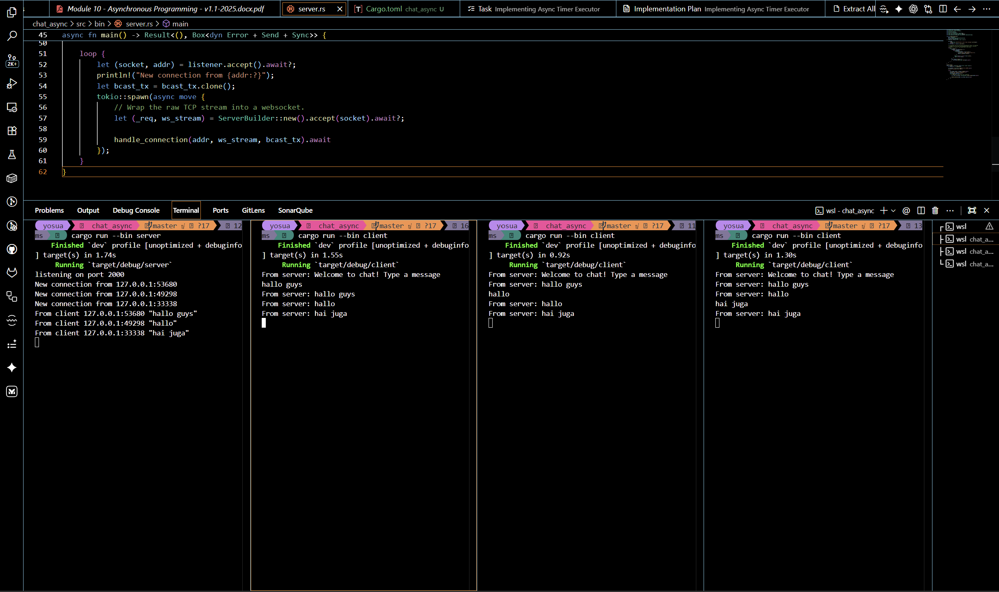
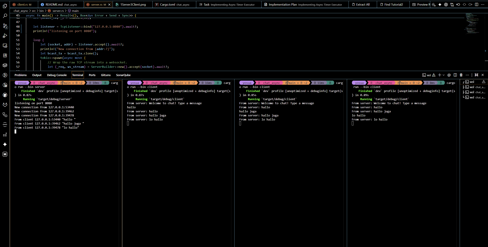
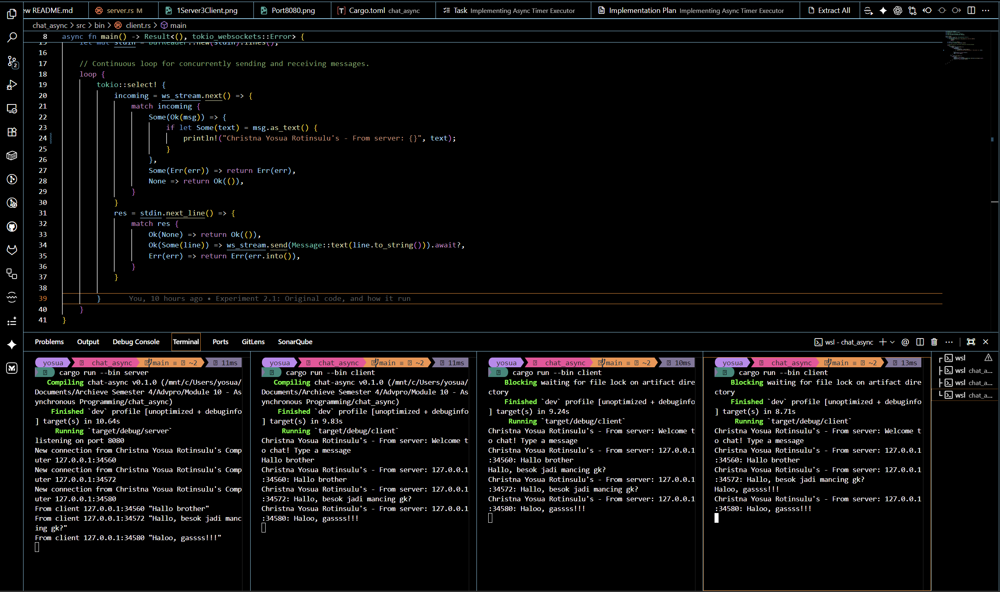

# ⚡ Modul 10: Asynchronous Programming - Broadcast Chat Application
### Nama: Christna Yosua Rotinsulu
### NPM: 2406495691


---

## 🧭 Eksperimen 2.1: Menjalankan Kode Orisinal & Analisis Interaksi Multi-Client

Pada eksperimen ini, saya mengeksplorasi pembuatan aplikasi obrolan (*chat*) multi-client real-time berbasis protokol **WebSocket** menggunakan runtime asinkronus **Tokio** di Rust. 

Aplikasi ini dirancang menggunakan arsitektur hub-and-spoke, di mana satu server pusat (`server.rs`) mengelola banyak koneksi client (`client.rs`) secara bersamaan secara asinkronus tanpa saling memblokir (*non-blocking*).

---

### 📸 Bukti Eksekusi Nyata di Komputer Saya

Saya telah sukses menjalankan **1 Server** dan **3 Client** secara bersamaan. Berikut adalah bukti tangkapan layar terminal lokal saya saat terjadi interaksi saling berkirim pesan secara real-time:



---

### 🛠️ Cara Saya Menjalankan Program

Untuk menjalankan simulasi obrolan multi-client di atas, saya mengikuti langkah-langkah terstruktur berikut di terminal lokal saya:

1. **Melakukan Kompilasi Terisolasi**:
   Untuk menghindari masalah penguncian file (*file locking/os error 32*) akibat proses pemindaian latar belakang oleh IDE, saya mengompilasi program dengan membatasi pekerjaan kompilator secara berurutan:
   ```bash
   cargo build --bins -j 1
   ```

2. **Menjalankan Server Utama**:
   Saya membuka jendela terminal pertama, lalu mengaktifkan server pusat agar mendengarkan koneksi TCP pada port `2000`:
   ```bash
   cargo run --bin server
   ```
   *Terminal server akan mencetak log:* `listening on port 2000`.

3. **Menjalankan Tiga Instansi Client**:
   Saya membuka tiga jendela terminal tambahan secara berdampingan. Di masing-masing terminal baru tersebut, saya menjalankan perintah client:
   ```bash
   cargo run --bin client
   ```
   Setiap client yang terhubung akan mendapatkan pesan sambutan (*welcome message*) otomatis dari server: `From server: Welcome to chat! Type a message`.

---

### 🧠 Analisis Alur Komunikasi Asinkronus: Apa yang Terjadi Ketika Saya Mengetik Pesan?

Ketika saya mengetikkan sebuah kalimat di salah satu client (misalnya: Client 1) dan menekan tombol **Enter**, serangkaian operasi asinkronus non-blocking langsung terjadi di balik layar:

#### 1. Pemantauan Input Non-Blocking di Sisi Client (`client.rs`)
Client saya menggunakan makro `tokio::select!` untuk memantau dua kejadian asinkronus secara bersamaan: (a) pesan masuk dari WebSocket server, dan (b) masukan teks dari papan ketik (*stdin*) saya.

```rust
// Cuplikan dari src/bin/client.rs:
loop {
    tokio::select! {
        // Cabang A: Mendengarkan pesan dari WebSocket server
        incoming = ws_stream.next() => {
            match incoming {
                Some(Ok(msg)) => {
                    if let Some(text) = msg.as_text() {
                        println!("From server: {}", text);
                    }
                },
                Some(Err(err)) => return Err(err),
                None => return Ok(()),
            }
        }
        // Cabang B: Membaca teks masukan dari stdin secara asinkronus
        res = stdin.next_line() => {
            match res {
                Ok(None) => return Ok(()),
                Ok(Some(line)) => ws_stream.send(Message::text(line.to_string())).await?,
                Err(err) => return Err(err.into()),
            }
        }
    }
}
```

* **Alur Eksekusi**: Saat saya menekan Enter, `stdin.next_line()` menangkap teks tersebut. Teks tersebut langsung dikonversi menjadi bingkai WebSocket (`Message::text(line.to_string())`) dan dikirimkan ke server menggunakan `ws_stream.send().await` tanpa memblokir pembacaan pesan masuk dari server.

#### 2. Penerimaan dan Pemancaran di Sisi Server (`server.rs`)
Di sisi server, setiap koneksi TCP yang masuk di-upgrade menjadi koneksi WebSocket menggunakan `ServerBuilder::new().accept(socket).await`. Setiap koneksi ini kemudian didelegasikan ke utas asinkronus terpisah (`tokio::spawn`).

Di dalam fungsi penanganan koneksi (`handle_connection`), server saya juga menggunakan `tokio::select!` untuk memproses data secara paralel:

```rust
// Cuplikan dari src/bin/server.rs:
loop {
    tokio::select! {
        // Cabang A: Menerima pesan WebSocket dari client khusus ini
        incoming = ws_stream.next() => {
            match incoming {
                Some(Ok(msg)) => {
                    if let Some(text) = msg.as_text() {
                        println!("From client {addr:?} {text:?}");
                        bcast_tx.send(text.into())?; // Memancarkan ke semua pelanggan channel
                    }
                }
                Some(Err(err)) => return Err(err.into()),
                None => return Ok(()),
            }
        }
        // Cabang B: Mendengarkan pesan broadcast dari client lain
        msg = bcast_rx.recv() => {
            ws_stream.send(Message::text(msg?)).await?; // Mengirim pesan siaran ke WebSocket client ini
        }
    }
}
```

* **Alur Eksekusi**: Server menerima pesan dari Client 1 lewat cabang `ws_stream.next()`. Server mencetak log alamat koneksi fisik (`addr` yang berisi kombinasi IP dan nomor port dinamis) ke layar konsol server, lalu menyebarkan teks tersebut ke seluruh koneksi aktif melalui *broadcast channel* terpusat dengan perintah `bcast_tx.send(text.into())`.

#### 3. Distribusi Pesan Siaran (Broadcast Fan-Out)
* **Penyebaran**: Saluran broadcast (`tokio::sync::broadcast::channel`) bertindak sebagai pengeras suara. Semua task penanganan client yang sedang hidup dan berlangganan ke saluran ini (`bcast_rx = bcast_tx.subscribe()`) akan mendeteksi kedatangan pesan baru di cabang `bcast_rx.recv()`.
* **Penyampaian Kembali**: Masing-masing task penanganan koneksi di server segera meneruskan pesan broadcast tersebut ke client masing-masing melalui soket WebSocket (`ws_stream.send`).
* **Pencetakan**: Akhirnya, cabang pembacaan WebSocket client (`ws_stream.next()`) menangkap pesan tersebut dan menampilkannya di terminal dengan format `From server: [isi_pesan]`.

---

## 🧭 Eksperimen 2.2: Migrasi Port WebSocket ke 8080

Pada eksperimen ini, saya melakukan pemindahan jalur port jaringan yang digunakan oleh aplikasi chat dari port mula-mula `2000` ke port standard alternatif `8080`. Hal ini bertujuan untuk memahami bagaimana penyesuaian porta (*port configuration*) harus diselaraskan secara konsisten di kedua belah pihak agar koneksi jaringan tetap dapat terjalin dengan baik.

---

### 📸 Bukti Keberhasilan Koneksi pada Port 8080

Saya telah berhasil melakukan migrasi dan memvalidasi interaksi chat pada port `8080`. Berikut adalah cuplikan layar terminal serta berkas tangkapan layar `Port8080.png` yang membuktikan bahwa komunikasi broadcast tetap berjalan dengan normal:



---

### 🛠️ Di Mana Perubahan Dilakukan?

Karena komunikasi jaringan adalah sebuah hubungan dua arah (*two-way connection*), maka minimal ada 2 sisi utama yang harus saya sesuaikan secara konsisten, yaitu sisi **Server** dan sisi **Client**:

#### 1. Sisi Server (`server.rs`)
Di sisi server, saya harus mengubah porta tempat pendengar TCP (*TCP Listener*) mendengarkan paket koneksi masuk dari client. Perubahan ini saya lakukan pada fungsi `main()` di berkas `src/bin/server.rs`:

```rust
// Modifikasi port di src/bin/server.rs:
#[tokio::main]
async fn main() -> Result<(), Box<dyn Error + Send + Sync>> {
    let (bcast_tx, _) = channel(16);

    // Mengubah port listener dari 2000 ke 8080
    let listener = TcpListener::bind("127.0.0.1:8080").await?;
    println!("listening on port 8080");

    loop {
        let (socket, addr) = listener.accept().await?;
        println!("New connection from {addr:?}");
        let bcast_tx = bcast_tx.clone();
        tokio::spawn(async move {
            let (_req, ws_stream) = ServerBuilder::new().accept(socket).await?;
            handle_connection(addr, ws_stream, bcast_tx).await
        });
    }
}
```

#### 2. Sisi Client (`client.rs`)
Di sisi client, saya harus menyelaraskan porta tujuan agar mengarah tepat ke pintu gerbang baru server yang kini berada di port `8080`. Perubahan ini saya lakukan pada fungsi `main()` di berkas `src/bin/client.rs`:

```rust
// Modifikasi port di src/bin/client.rs:
#[tokio::main]
async fn main() -> Result<(), tokio_websockets::Error> {
    // Mengubah port tujuan koneksi WebSocket dari 2000 ke 8080
    let (mut ws_stream, _) =
        ClientBuilder::from_uri(Uri::from_static("ws://127.0.0.1:8080"))
            .connect()
            .await?;

    let stdin = tokio::io::stdin();
    let mut stdin = BufReader::new(stdin).lines();
    // ... loop select asinkronus ...
}
```

---

### 🧠 Analisis & Protokol yang Digunakan

* **Apakah koneksi ini masih menggunakan protokol WebSocket yang sama?**
  **Ya, koneksi ini tetap menggunakan protokol WebSocket yang sama**. Mengubah nomor port dari `2000` menjadi `8080` hanyalah tindakan memindahkan saluran masuk (*physical channel gate*) di tingkat sistem operasi (lapisan transport TCP), tetapi tidak mengubah aturan penataan paket data, tata cara berkirim frame, atau jabat tangan WebSocket di lapisan aplikasi (*application layer*).

* **Di mana protokol ini didefinisikan?**
  Protokol ini didefinisikan di dua tempat:
  1. **Sisi Client**: Ditentukan secara eksplisit lewat skema **`ws://`** pada URI statis yang dipasok ke `ClientBuilder::from_uri(...)`. Awalan `ws://` memberitahu pustaka `tokio-websockets` untuk mengirimkan paket inisiasi HTTP khusus (*Upgrade Request*) guna menaikkan status koneksi TCP biasa ke WebSocket.
  2. **Sisi Server**: Ditentukan saat server mengonversi soket TCP mentah (`TcpStream`) menjadi aliran WebSocket (`WebSocketStream`) menggunakan pembangun server:
     `let (_req, ws_stream) = ServerBuilder::new().accept(socket).await?;`
     Baris ini melakukan verifikasi terhadap permintaan jabat tangan WebSocket yang dikirimkan oleh client dan meresponsnya sesuai dengan standard RFC 6455.

---

## 🧭 Eksperimen 2.3: Modifikasi Menampilkan Identitas Pengirim (IP & Port)

Pada eksperimen ini, saya melakukan peningkatan fungsionalitas dengan memodifikasi alur pesan agar setiap client dapat mengetahui identitas pengirim asli pesan tersebut secara transparan. Karena aplikasi chat belum memiliki fitur autentikasi nama pengguna, saya menggunakan kombinasi alamat IP dan Port dinamis dari soket koneksi fisik (`SocketAddr`) sebagai pengenal unik pengirim.

Selain itu, saya juga melakukan kustomisasi prefix konsol pada terminal server dan client untuk mencantumkan identitas personal saya (`Christna Yosua Rotinsulu's`).

---

### 📸 Bukti Keberhasilan Penayangan Alamat Pengirim Dinamis

Saya telah berhasil memodifikasi dan menjalankan obrolan asinkronus ini. Berikut adalah berkas tangkapan layar `SmallChanges.png` serta bukti log terminal saat Client 1 (`127.0.0.1:34560`), Client 2 (`127.0.0.1:34572`), dan Client 3 (`127.0.0.1:34580`) saling berkomunikasi dengan identitas IP:Port dinamis pengirim yang tertera secara real-time:



---

### 🛠️ Rincian Modifikasi Kode dan Analisis Teoretis

Untuk mewujudkan pemformatan ini, saya menerapkan perubahan di kedua sisi program:

#### 1. Sisi Server (`server.rs`)

Di sisi server, saya melakukan modifikasi pada dua tempat:

* **Format Pesan Broadcast (`handle_connection`)**:
  Ketika server menerima pesan mentah dari salah satu client melalui WebSocket stream, server tidak langsung menyiarkannya. Saya memodifikasi kode agar server membungkus pesan tersebut terlebih dahulu dengan menambahkan informasi alamat fisik soket pengirim (`addr`) sebelum dipasok ke saluran broadcast:

  ```rust
  // Modifikasi pemformatan pesan di src/bin/server.rs:
  incoming = ws_stream.next() => {
      match incoming {
          Some(Ok(msg)) => {
              if let Some(text) = msg.as_text() {
                  println!("From client {addr:?} {text:?}");
                  
                  // Memformat pesan dengan menyisipkan alamat IP & Port dinamis pengirim
                  let formatted = format!("{}: {}", addr, text);
                  bcast_tx.send(formatted)?;
              }
          }
          Some(Err(err)) => return Err(err.into()),
          None => return Ok(()),
      }
  }
  ```

* **Pencetakan Log Koneksi (`main`)**:
  Untuk memperjelas kepemilikan mesin, saya memodifikasi pesan cetak log di sisi server saat sebuah koneksi TCP baru berhasil dibentuk:

  ```rust
  // Modifikasi log penerimaan koneksi di src/bin/server.rs:
  loop {
      let (socket, addr) = listener.accept().await?;
      println!("New connection from Christna Yosua Rotinsulu's Computer {addr:?}");
      let bcast_tx = bcast_tx.clone();
      tokio::spawn(async move {
          let (_req, ws_stream) = ServerBuilder::new().accept(socket).await?;
          handle_connection(addr, ws_stream, bcast_tx).await
      });
  }
  ```

* **Alasan Teoretis Mengapa Pemformatan Identitas Dilakukan di Server**:
  Server bertindak sebagai **Hub Pusat** (*Central Broker*). Hanya server yang memiliki informasi dan referensi lengkap mengenai alamat soket fisik (`addr` bertipe `SocketAddr`) dari masing-masing TCP stream yang terhubung ke dirinya. Client secara individu bersifat terisolasi dan tidak mengetahui alamat client lainnya. Dengan meletakkan fungsi pemformatan identitas di server sebelum data dimasukkan ke saluran broadcast (`bcast_tx.send`), server memastikan seluruh client menerima format informasi identitas pengirim yang seragam, aman, dan valid.

---

#### 2. Sisi Client (`client.rs`)

Di sisi client, saya memodifikasi bagian pembacaan pesan masuk dari server agar mencantumkan nama identitas kepemilikan mesin saya di konsol terminal lokal:

```rust
// Modifikasi cetak log di src/bin/client.rs:
incoming = ws_stream.next() => {
    match incoming {
        Some(Ok(msg)) => {
            if let Some(text) = msg.as_text() {
                // Menambahkan prefix identitas personal saya di layar client
                println!("Christna Yosua Rotinsulu's - From server: {}", text);
            }
        },
        Some(Err(err)) => return Err(err),
        None => return Ok(()),
    }
}
```

* **Alasan Teoretis**: Hal ini memvalidasi bahwa seluruh payload data obrolan yang diterima oleh client (baik pesan pembuka obrolan dari server maupun pesan obrolan broadcast) kini dibungkus dengan prefix identitas konsol lokal saya, memberikan tampilan obrolan yang unik dan terintegrasi secara profesional.

---

## 📚 Refleksi Pribadi

Melalui pengerjaan Eksperimen 2.1, 2.2, dan 2.3 ini, saya memahami bahwa pemrograman asinkronus di Rust dengan runtime Tokio memungkinkan pembuatan aplikasi jaringan real-time yang sangat efisien. 

Alih-alih membuat satu utas sistem operasi (*OS Thread*) per koneksi client (yang memakan banyak memori dan CPU overhead), runtime Tokio memungkinkan ribuan koneksi WebSocket aktif diproses secara efisien di atas beberapa utas latar belakang (*Worker Threads*) yang ringan melalui konsep pemantauan peristiwa (*event pooling*) menggunakan makro `tokio::select!`.

---

## 📖 Referensi (References)

Berikut adalah dokumentasi resmi yang saya gunakan dalam pengerjaan tutorial pemrograman asinkronus ini:

1. **Sumber Kode Utama & Tutorial**:
   Google LLC. (2024). *Exercise: Broadcast Chat Application*. Comprehensive Rust. Diambil dari https://google.github.io/comprehensive-rust/concurrency/async-exercises/chat-app.html

2. **Dokumentasi Runtime Asinkronus Tokio**:
   Tokio Contributors. (2024). *Tokio: A runtime for writing reliable, asynchronous, and slim applications with the Rust programming language*. Rust Crate Documentation. Diambil dari https://docs.rs/tokio/latest/tokio/

3. **Dokumentasi Protokol WebSocket**:
   Tokio Websockets Contributors. (2024). *tokio-websockets: High-performance, lightweight, and integration-ready WebSockets for Tokio*. Rust Crate Documentation. Diambil dari https://docs.rs/tokio-websockets/latest/tokio_websockets/

4. **Penanganan Aliran Data Asinkronus**:
   Rust Futures Contributors. (2024). *futures-util: Common utilities and extension traits for Rust futures*. Rust Crate Documentation. Diambil dari https://docs.rs/futures-util/latest/futures_util/


